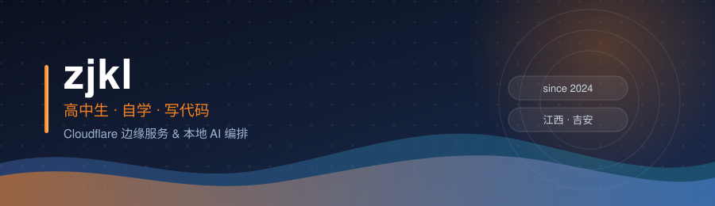
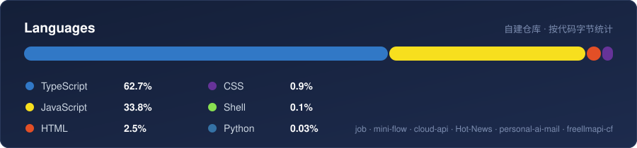

 

**高中生，自学。两条主线：跑在 Cloudflare 边缘的服务，和编排 AI 编码代理的本地系统。**

下面的项目都能线上访问。标注约定：**自研** = 代码由我写成；**二次开发** = 基于上游项目改造，已注明上游；**部署在用** = 拿上游部署，不声称原创；**已停用** = 仓库与对应服务不再维护。

## 🚀 精选项目

**🧠 [job](https://github.com/827802685/job) — 牛马工作室 + Job 状态层（单进程合并版）** &nbsp;`工作室子系统二次开发（上游 Leeeger1/niuma-studio，MIT）；Job 状态层自研`

工作室部分沿用上游的编排模型：你只跟总管说话，她把任务拆给「项目组 × 员工」——项目组是一个模型后端（Claude Code / Codex / OpenCode / Qoder / Trae / DeepSeek CLI 及任意 OpenAI 兼容接口），员工是一个技能文件；彩排模式用模拟代理走完整流程，不消耗额度、不改动文件。我做的是合并与改造：把原本的双进程、两套控制台收敛成单进程单端口的一版，入口 `bin/niuma.js`、配置格式与控制台页面均已改动。自研的是挂在同进程 `/job/*` 路由上的 Job 状态层：意图路由 → 分级权限裁定（未授权默认拒绝）→ 执行租约 → 多道校验门禁 → 审计记录 → 工单归档，入口是首页的「管家」面板。

**⚡ [mini-flow](https://github.com/827802685/mini-flow) — 跑在 Workers 上的轻量工作流引擎** &nbsp;`后端自研，前端复用 n8n editor-ui`

按 n8n 的节点模型自行实现了 REST 接口与 Push(SSE) 协议，因此画布可以直接用官方 editor-ui，无需改动。存储分层：D1 存运行状态，KV 存凭据，Durable Object 转发 SSE，Workflows 负责断点续跑；运行时带检查点、幂等重试、死信队列与防重叠锁。取舍理由见 [`DECISIONS.md`](https://github.com/827802685/mini-flow/blob/main/DECISIONS.md)。

**☁️ [clist](https://clist.zjkl.dpdns.org) — 网盘列表 / 图床 / 对象存储聚合** &nbsp;`二次开发，基于 CloudPaste`

以 CloudPaste 为基座，合并 CloudFlare-ImgBed 的图床能力与 Cloudflare-Clist 的多网盘聚合，一个 Worker 同时提供三种服务，长期在线。开发在私有仓 `clist-cf`，公开镜像 [cloud-drive](https://github.com/827802685/cloud-drive) 与之同源（`package.json` 一致，仅部署参数不同）。

**🔀 [freellmapi-cf](https://github.com/827802685/freellmapi-cf) — 免费模型路由** &nbsp;`已停用`

曾经聚合约 20 家提供商的免费额度，对外只暴露一个 OpenAI 兼容端点，按可用性做分发与故障转移，线上跑到 v3.6.0。这个仓库我已不再维护，历史地址 **[api.zjkl0330.dpdns.org](https://api.zjkl0330.dpdns.org)** 保留仅作存档，不保证可用。

**📮 [personal-ai-mail](https://github.com/827802685/personal-ai-mail) — 单用户 AI 邮件系统** &nbsp;`二次开发，主体框架来自 maillab/cloud-mail`

在 cloud-mail 的收信与存储骨架上，自己写了验证码提取、FTS5 中文全文搜索，以及 11 个供 Agent 调用的 MCP 工具接口。线上 **[mail.zjkl.qzz.io](https://mail.zjkl.qzz.io)**。

**另外自己写的**：**hot-news**（热榜聚合 + RSS + 多通道推送的 Worker，即上面的新闻墙）、**extraction**（7 大平台短视频/图片无水印解析）、**Password-UUID-Generator**、**web-clipboard**、**tampermonkey** 脚本集、**domain-alert**（本仓库内的探活配置）。 
**二次开发并在跑**（上游已在括号注明）：**Rin**（openRin/Rin）、**UptimeFlare**（lyc8503/UptimeFlare）、**MoonTV**（samqin123/MoonTV）、**SPlayer**（kingfly0927/SPlayer）、**TrendRadar**（sansan0/TrendRadar）、**music**（meting-backend-js）、**personal-ai-mail**（maillab/cloud-mail，见上）。 
**同源部署他人项目，不声称原创**：**RSSWorker**、**tg-img**、**ra2web**、**Live2D 看板娘**、**NextChat**、**Sink**；**cloud-api**（AI 网关，Workers + D1 与 Docker 双部署）改造幅度不等，上游与许可以其仓库内 README、LICENSE 为准。

 

## 🌐 在跑的服务

> 全部自托管在 Cloudflare。清单以自建探活页 [uptime.zjkl.dpdns.org](https://uptime.zjkl.dpdns.org) 的配置为准，2026-10-07 逐个复核返回 HTTP 200；标了「已停用」的行是存档，地址可能仍能访问，但我不再维护其代码。

| 服务 | 地址 | 说明 |
| :--- | :--- | :--- |
| 🏠 **主页** | [zjkl.qzz.io](https://zjkl.qzz.io) | 个人门户 |
| 📝 **博客** | [blog.zjkl.qzz.io](https://blog.zjkl.qzz.io) | Rin 改造 · Workers + D1 + R2 |
| 🔥 **新闻墙** | [news.zjkl.qzz.io](https://news.zjkl.qzz.io) | 自写采集，15 分钟一轮 |
| ☁️ **云盘 / 图床** | [clist.zjkl.dpdns.org](https://clist.zjkl.dpdns.org) | 基于 CloudPaste 的三合一聚合 |
| 📮 **邮箱** | [mail.zjkl.qzz.io](https://mail.zjkl.qzz.io) | 基于 cloud-mail 的 AI 分类、验证码提取、全文搜索 |
| 🔀 **免费模型**（已停用） | [api.zjkl0330.dpdns.org](https://api.zjkl0330.dpdns.org) | freellmapi-cf 存档地址，仓库不再维护 |
| 🛰 **AI 网关** | [api.zjkl.dpdns.org](https://api.zjkl.dpdns.org) | cloud-api 管理后台 |
| 💬 **Chat** | [chat.zjkl.dpdns.org](https://chat.zjkl.dpdns.org) | NextChat 部署 |
| 📊 **探活 / 状态页** | [uptime](https://uptime.zjkl.dpdns.org) · [status](https://status.zjkl.dpdns.org) | UptimeFlare 双实例 |
| 🔗 **短链** | [zjkl0330.dpdns.org](https://zjkl0330.dpdns.org) | Sink 部署 |

另有 RSS 订阅源、模型雷达、视频解析、在线剪贴板、密码与地址生成器、GitHub 加速镜像，以及 TV / 小游戏一类的自用站点，都分布在域名族 <code>*.zjkl.qzz.io</code> · <code>*.zjkl.dpdns.org</code> · <code>*.zjkl0330.dpdns.org</code> · <code>*.zjkl0426.dpdns.org</code> · <code>*.zjkl0716.dpdns.org</code> 下，状态以探活页为准。

 

## 🛠 技术栈

 

 

 

## 📊 Activity

  

 

 

## 🤝 合作

对 **Cloudflare Workers / 边缘计算 / AI Agent 编排**感兴趣，开 issue 直接聊。接小的自建工具与脚本需求。不接代写、刷量，以及任何要求编造数据的活。

加入 GitHub：2024-02-08 · 坐标：中国 江西 吉安

**能跑起来的才算数。**

